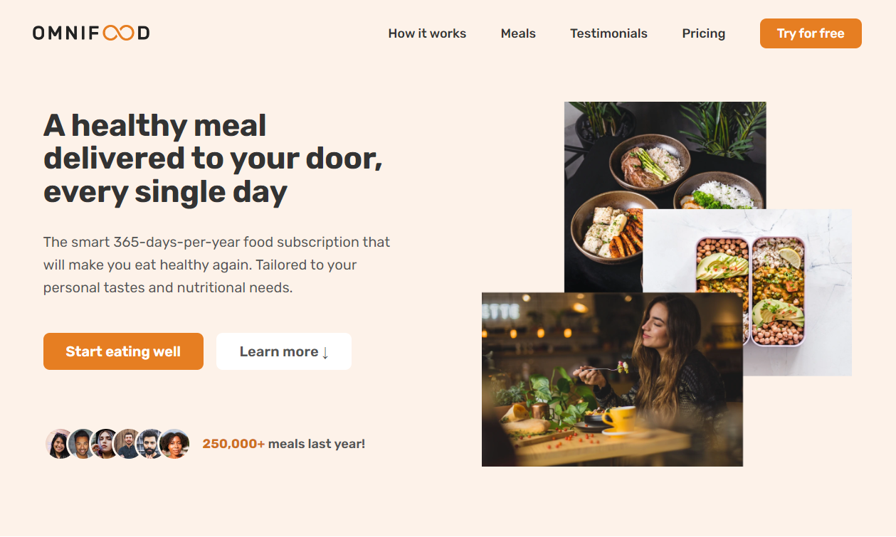

<a name="readme-top"></a>

[![LinkedIn][linkedin-shield]][linkedin-url]

<!-- PROJECT LOGO -->
<br />
<div align="center">
  <a href="https://omnifood-melissaeb.netlify.app/">
    
  </a>

<h3 align="center">Omnifood</h3>

  <p align="center">
    Omnifood is a web application that offers a variety of healthy and delicious meals delivered right to your doorstep. With a user-friendly interface and a wide range of menu options, Omnifood aims to make healthy eating convenient and enjoyable.
    <br />
    <a href="https://github.com/Melissaeb/omnifood"><strong>Explore the docs »</strong></a>
    <br />
    <br />
    <a href="https://omnifood-melissaeb.netlify.app/">View Demo</a>
    ·
    <a href="https://github.com/Melissaeb/omnifood/issues/new?labels=bug&template=bug-report---.md">Report Bug</a>
    ·
    <a href="https://github.com/Melissaeb/omnifood/issues/new?labels=enhancement&template=feature-request---.md">Request Feature</a>
  </p>
</div>

<!-- TABLE OF CONTENTS -->
<details>
  <summary>Table of Contents</summary>
  <ol>
    <li>
      <a href="#about-the-project">About The Project</a>
      <ul>
        <li><a href="#built-with">Built With</a></li>
      </ul>
    </li>
    <li>
      <a href="#getting-started">Getting Started</a>
    </li>
    <li><a href="#roadmap">Roadmap</a></li>
    <li><a href="#contributing">Contributing</a></li>
    <li><a href="#contact">Contact</a></li>
    <li><a href="#acknowledgments">Acknowledgments</a></li>
  </ol>
</details>

<!-- ABOUT THE PROJECT -->

## About The Project

<a href="https://omnifood-melissaeb.netlify.app/">
    
</a>

### Features

- Browse through our menu and select your favorite meals
- Customize your meals based on dietary preferences or restrictions
- Place orders and track their status in real-time
- Receive notifications and updates on your orders

<p align="right">(<a href="#readme-top">back to top</a>)</p>

### Built With

- HTML
- CSS
- JavaScript

<p align="right">(<a href="#readme-top">back to top</a>)</p>

<!-- GETTING STARTED -->

## Getting Started

To get a local copy up and running, just clone the repo:

```sh
git clone https://github.com/Melissaeb/omnifood.git
```

<p align="right">(<a href="#readme-top">back to top</a>)</p>

<!-- ROADMAP -->

## Roadmap

See the [open issues](https://github.com/Melissaeb/omnifood/issues) for a full list of proposed features (and known issues).

<p align="right">(<a href="#readme-top">back to top</a>)</p>

<!-- CONTRIBUTING -->

## Contributing

Contributions are what make the open source community such an amazing place to learn, inspire, and create. Any contributions you make are **greatly appreciated**.

If you have a suggestion that would make this better, please fork the repo and create a pull request. You can also simply open an issue with the tag "enhancement".
Don't forget to give the project a star! Thanks again!

1. Fork the Project
2. Create your Feature Branch (`git checkout -b feature/AmazingFeature`)
3. Commit your Changes (`git commit -m 'Add some AmazingFeature'`)
4. Push to the Branch (`git push origin feature/AmazingFeature`)
5. Open a Pull Request

<p align="right">(<a href="#readme-top">back to top</a>)</p>

<p align="right">(<a href="#readme-top">back to top</a>)</p>

<!-- CONTACT -->

## Contact

Melissa Elliston-Boyes

LinkedIn: [https://www.linkedin.com/in/melissa-elliston-boyes-158259301/](https://www.linkedin.com/in/melissa-elliston-boyes-158259301/)
Project Link: [https://github.com/Melissaeb/omnifood](https://github.com/Melissaeb/omnifood)

<p align="right">(<a href="#readme-top">back to top</a>)</p>

<!-- ACKNOWLEDGMENTS -->

## Acknowledgments

Thank you so much to [Jonas Schmedtman](https://codingheroes.io/), whose excellent teachings I followed to create this site. You can buy his Udemy course at [this link](https://www.udemy.com/design-and-develop-a-killer-website-with-html5-and-css3/?couponCode=C1WEBSITE1010&utm_source=mycoupon&utm_medium=website1010&utm_campaign=website1010).

<p align="right">(<a href="#readme-top">back to top</a>)</p>

<!-- MARKDOWN LINKS & IMAGES -->

[linkedin-shield]: https://img.shields.io/badge/-LinkedIn-black.svg?style=for-the-badge&logo=linkedin&colorB=555
[linkedin-url]: https://www.linkedin.com/in/melissa-elliston-boyes-158259301/
